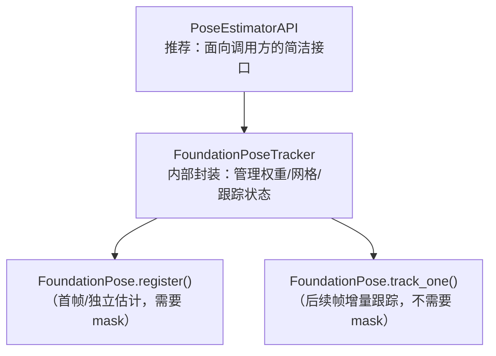

# FoundationPose 位姿估计 API 使用说明

本文档说明如何在**其他脚本 / 模块**中直接 `import` [foundationpose_api.py](foundationpose_api.py)，
调用其中封装好的 `PoseEstimatorAPI` 完成 6-DoF 目标位姿估计，涵盖**单帧调用**与
**摄像头/视频连续帧调用**两种典型场景，以及所有相关输入/输出参数的说明。

> 如果只是想跑现成的 CLI 脚本（视频/摄像头实时可视化），请直接使用
> `python foundationpose_api.py --mesh ... --input ...`（见文件头部 docstring），
> 本文档只针对**代码里直接调用 API** 的场景。

---

## 1. 核心概念：两个类的关系

`foundationpose_api.py` 里有两层接口，其他代码通常只需要用 **`PoseEstimatorAPI`**：



| 方法 | 对应底层调用 | 是否需要 mask | 是否依赖上一帧 | 速度 | 用途 |
|---|---|---|---|---|---|
| `estimate()` | `register()` | 需要 | 不依赖（可选清空历史状态） | 较慢（含旋转假设采样 + 打分选优） | 首帧初始化 / 单帧独立估计 / 跟踪丢失后重新初始化 |
| `track()` | `track_one()` | 不需要 | 依赖（用上一帧姿态作为起点精化） | 更快 | 摄像头/视频连续帧的实时跟踪 |

---

## 2. 准备工作

```python
import numpy as np
from foundationpose_api import PoseEstimatorAPI

# 相机内参 3x3 矩阵（可从标定结果 / cam_K.txt 加载）
K = np.loadtxt("pose_estimation_data/cam_K.txt").reshape(3, 3)

# 构造一次 estimator：会加载 CAD 网格 + 权重（ScorePredictor / PoseRefinePredictor），
# 耗时数秒级，只应做一次，不要在循环里重复构造。
estimator = PoseEstimatorAPI(
    mesh_file="nut_mesh/textured_simple.obj",   # 目标物体 CAD 网格
    K=K,
)
```

依赖环境：需要 CUDA + 编译好的 FoundationPose 扩展（`estimater`/`Utils`/`nvdiffrast`），
且需要设置环境变量 `FOUNDATIONPOSE_ROOT` 指向 FoundationPose 源码根目录（或将本文件
放在其源码目录下），详见 [foundationpose_api.py](foundationpose_api.py) 头部说明。

---

## 3. 单帧调用（独立估计，互不依赖）

适用场景：离线批处理、关键帧逐帧独立估计（如本仓库 [05_collect_pose_estimation_data_mujoco.py](05_collect_pose_estimation_data_mujoco.py) 采集的离散关键帧）、精度验证脚本
（如 [08_compute_nut_pose_in_base.py](08_compute_nut_pose_in_base.py)）等。

```python
# rgb   : uint8, (H, W, 3)，RGB 通道顺序（不是 BGR！）
# mask  : uint8 / bool, (H, W)，>0 或 True 表示目标区域
# depth : float32, (H, W)，单位：米（可选，不给则用假设深度，z 平移不准）
pose_4x4 = estimator.estimate(rgb=rgb_img, mask=mask_img, depth=depth_img)

# pose_4x4: np.ndarray, shape (4, 4), float64
#   物体坐标系 -> 相机坐标系（OpenCV 约定：+X右 +Y下 +Z前）的齐次变换矩阵
```

`estimate()` 默认 `reinit=True`：**每次调用前都会先清空内部跟踪状态**，保证本次
估计与上一次调用完全独立、互不影响。适合下面这种"对多张互不相关的图片分别求位姿"
的用法：

```python
for rgb, mask, depth in dataset:               # 每一份数据互不相关
    pose = estimator.estimate(rgb, mask, depth)  # 每次都是全新独立估计
    ...
```

---

## 4. 摄像头 / 视频连续帧调用（首帧估计 + 后续帧跟踪）

适用场景：对着摄像头或视频实时/连续估计同一个物体的运动轨迹，追求速度。
典型模式是"首帧（或需要重新初始化时）用 `estimate()`，后续帧用 `track()`"：

```python
initialized = False

while True:
    rgb, depth = read_next_frame()   # 你自己的取流逻辑

    if not initialized:
        mask = get_mask_for_first_frame(rgb)   # 首帧需要 mask（比如分割网络/人工框选）
        pose = estimator.estimate(rgb, mask=mask, depth=depth, reinit=False)
        initialized = True
    else:
        pose = estimator.track(rgb, depth=depth)   # 后续帧：不需要 mask，速度更快

    # pose: (4, 4)，物体在当前帧相机坐标系下的位姿
    consume(pose)
```

**关键点：首帧调用 `estimate()` 时要传 `reinit=False`**，这样估计结果会正常写入
内部跟踪状态，紧接着才能调用 `track()` 继续跟踪；如果用默认的 `reinit=True`，
效果和单帧独立估计一样（但因为 `estimate()` 本身内部会先做一次 register 再把结果
写入状态，实际上后面依然可以 `track()`——`reinit` 影响的只是"调用前是否清空历史
状态"，不影响"调用后是否更新状态"）。简单记忆：

- **只做单帧独立估计**：`estimator.estimate(rgb, mask, depth)`（用默认值即可）。
- **视频/摄像头连续帧**：首帧或需要重新初始化时 `estimator.estimate(rgb, mask, depth)`，
  之后每帧 `estimator.track(rgb, depth)`。

### 4.1 跟踪丢失 / 需要重新初始化

`track()` 是增量式的，如果物体被遮挡、跳变或者跟丢了，需要重新提供 mask 走一次
`estimate()` 重新初始化：

```python
if pose_confidence_too_low(pose):
    mask = get_mask_again(rgb)          # 重新分割/框选
    pose = estimator.estimate(rgb, mask=mask, depth=depth)
```

也可以显式调用 `estimator.reset()` 清空状态（不会立即触发估计，只是让下一次
`estimate()` 视为全新的独立估计；`track()` 在 reset 后、estimate 前调用会报错）。

### 4.2 判断是否已经初始化

```python
if estimator.is_initialized:
    pose = estimator.track(rgb, depth)
else:
    pose = estimator.estimate(rgb, mask, depth)
```

---

## 5. 参数说明

### 5.1 `PoseEstimatorAPI.__init__(...)`（只需要构造一次）

| 参数 | 类型 | 默认值 | 说明 |
|---|---|---|---|
| `mesh_file` | `str` | 必填 | 目标物体 CAD 网格路径（`.obj`/`.ply`/`.stl` 等 trimesh 支持的格式）。本仓库螺母网格见 [nut_mesh/textured_simple.obj](nut_mesh/textured_simple.obj)，由 [06_convert_nut_mesh_for_foundationpose.py](06_convert_nut_mesh_for_foundationpose.py) 生成，局部坐标系与仿真场景中 `square_nut` body 坐标系严格对齐。 |
| `K` | `np.ndarray (3,3)` | 必填 | 相机内参矩阵。 |
| `weights_dir` | `str` | 本文件同级 `weights/` | 预训练权重目录，内含 `refiner` / `scorer` 子目录。 |
| `est_refine_iter` | `int` | `5` | `estimate()`（register）的精化迭代次数，越大越准但越慢。 |
| `track_refine_iter` | `int` | `2` | `track()`（track_one）的精化迭代次数，跟踪阶段帧间运动通常较小，可以用更少迭代。 |
| `debug` | `int` | `0` | 调试级别：0=关闭，1=显示，2=保存中间调试文件。 |
| `debug_dir` | `str` | `"output"` | 调试文件保存目录（`debug>=1` 时生效）。 |

### 5.2 `estimator.estimate(rgb, mask, depth=None, reinit=True)`

| 参数 | 类型 | 说明 |
|---|---|---|
| `rgb` | `uint8, (H, W, 3)` | **RGB** 通道顺序（不是 OpenCV 默认的 BGR，如果用 `cv2.imread` 读图，需要先 `cv2.cvtColor(img, cv2.COLOR_BGR2RGB)`）。 |
| `mask` | `uint8 / bool, (H, W)` | 目标物体二值掩码，`>0` 或 `True` 表示目标区域，其余为背景。掩码质量直接影响估计精度。 |
| `depth` | `float32, (H, W)`，可选 | 单位**米**。不提供时用固定假设深度填充整张图（旋转估计仍有效，但 z 方向平移不可信，仅用于粗略调试）。 |
| `reinit` | `bool`，默认 `True` | `True`：调用前清空历史跟踪状态，本次视为完全独立的估计；`False`：不清空，估计结果正常更新跟踪状态，可紧接着调用 `track()`。 |

返回：`np.ndarray, float64, (4, 4)` —— 物体坐标系 → 相机坐标系（OpenCV 约定：+X右
+Y下 +Z前）的齐次变换矩阵，即 $p_{cam} = T \cdot p_{obj}$。

### 5.3 `estimator.track(rgb, depth=None)`

| 参数 | 类型 | 说明 |
|---|---|---|
| `rgb` | `uint8, (H, W, 3)` | 同上，RGB 顺序。 |
| `depth` | `float32, (H, W)`，可选 | 同上，单位米。 |

调用前必须已经通过 `estimate()` 完成过至少一次初始化，否则抛出 `RuntimeError`。
返回值格式同 `estimate()`。

### 5.4 其他方法

| 方法 | 说明 |
|---|---|
| `estimator.is_initialized` | 属性，`bool`，是否已经完成过至少一次 `estimate()`（可以开始调用 `track()`）。 |
| `estimator.reset()` | 清空内部跟踪状态，下一次 `estimate()` 视为全新的独立估计。 |
| `estimator.visualize(rgb, pose)` | 在图像上绘制 3D 包围框与坐标轴，返回 `uint8 BGR` 图像，便于 `cv2.imshow`/`cv2.imwrite` 调试可视化。 |

### 5.5 一次性便捷函数：`estimate_6dof_pose(...)`

如果只想调用一次、不想手动管理 `PoseEstimatorAPI` 实例，可以用这个免维护的自由函数
（内部会临时创建一个 `PoseEstimatorAPI`，用完即弃）：

```python
from foundationpose_api import estimate_6dof_pose

pose_4x4 = estimate_6dof_pose(
    mesh_file="nut_mesh/textured_simple.obj",
    rgb=rgb_img, mask=mask_img, K=K, depth=depth_img,
)
```

**注意**：权重和网格加载本身较慢（秒级），如果需要连续/多次调用，请直接使用
`PoseEstimatorAPI` 类并复用同一个实例，避免每次调用都重新加载。

---

## 6. 输出结果如何使用

`estimate()` / `track()` 返回的都是**物体在相机坐标系下的位姿** `T_obj_cam`
（4×4 齐次变换矩阵）。如果需要进一步换算到机械臂基坐标系（例如做抓取），
需要结合手眼关系和机械臂正向运动学做矩阵连乘，完整示例见
[08_compute_nut_pose_in_base.py](08_compute_nut_pose_in_base.py)：

```python
T_nut_base = T_gripper_base @ T_cam_gripper @ T_nut_cam
```

其中 `T_nut_cam` 就是本 API 的输出结果，`T_cam_gripper`（相机相对末端法兰的固定
安装关系）和 `T_gripper_base`（由机械臂关节角正向运动学计算）来自机器人本体，
不属于 FoundationPose API 的职责范围。

---

## 7. 常见问题

- **首帧一定要给 mask 吗？** 是的，`estimate()`（register）必须依赖 mask 确定目标
  的大致位置/朝向初值；`track()` 不需要 mask，因为它复用上一帧的姿态作为起点。
- **`reinit` 到底该传 True 还是 False？** 如果调用之后还想紧接着 `track()`
  连续跟踪，传 `False`；如果只是想做一次孤立的估计（比如批量处理很多不相关的图片），
  用默认的 `True` 即可。
- **`depth` 可以不传吗？** 可以，但 z 方向平移会不准确（仅用假设的固定深度），
  只建议在没有深度相机、只关心朝向的场景下使用。
- **多次调用会不会很慢？** 构造 `PoseEstimatorAPI(...)` 本身（加载权重、网格）
  较慢，应该只做一次；之后反复调用 `estimate()`/`track()` 不会重新加载，速度
  取决于 `est_refine_iter`/`track_refine_iter` 迭代次数。
